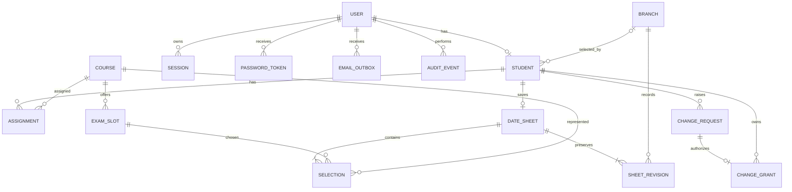

# Data model and integrity

## Entities
| Entity | Key fields |
|---|---|
| User | id, normalizedEmail unique, passwordHash nullable until setup, role ADMIN/STUDENT, active, createdAt |
| Session | id, userId, tokenHash unique, expiresAt, revokedAt |
| PasswordToken | id, userId, tokenHash unique, purpose SETUP/RESET, expiresAt, usedAt |
| Student | id, userId unique, registrationNumber unique, all personal/guardian/academic fields, selectedBranchId nullable, assignmentsFinalized, version |
| Branch | id, code unique, name, city, address, contactNumber, active |
| Course | id, code unique, title, creditHours, department, active |
| Assignment | id, studentId, courseId, createdAt; unique(studentId, courseId) |
| ExamSlot | id, courseId, startsAt, endsAt, status DRAFT/PUBLISHED, version |
| DateSheet | id, studentId unique, currentRevision, savedAt, updatedAt |
| Selection | id, dateSheetId, courseId, slotId; unique(dateSheetId, courseId) |
| SheetRevision | id, dateSheetId, revision, branchId, documentSnapshot JSON, reason, createdAt; unique(dateSheetId, revision) |
| ChangeRequest | id, studentId, type BRANCH/DATE_SHEET, reason, status, remark, reviewedBy, createdAt, reviewedAt |
| ChangeGrant | id, requestId unique, studentId, type, consumedAt nullable |
| EmailOutbox | id, userId, template, relatedEntityId, status, attempts, nextAttemptAt, sentAt, sanitizedError |
| AuditEvent | id, actorUserId, action, entityType, entityId, sanitizedMetadata, createdAt |

Personal/guardian/academic fields are exactly the groups in 01-REQUIREMENTS.md. It is acceptable to flatten them on Student for the hackathon. Keep full name on Student; admin display name can be a separate User field. Email is authoritative on User, not duplicated unsafely.

## ERD

## Constraints and indexes
- Normalize email by trimming/lowercasing before uniqueness checks; do not modify addresses with provider-specific dot/plus rules.
- Normalize branch/course/registration codes consistently, e.g. uppercase trimmed.
- Unique assignment(studentId, courseId), sheet(studentId), selection(sheetId, courseId), tokenHash, grant(requestId).
- Unique slot(courseId, startsAt, endsAt); CHECK endsAt > startsAt. Service also rejects past starts and cross-midnight local slots.
- Partial unique index on ChangeRequest(studentId, type) WHERE status='PENDING'.
- Partial unique index on ChangeGrant(studentId, type) WHERE consumedAt IS NULL.
- Foreign keys restrict removal of referenced academic records. Do not cascade-delete saved exam history.
- Composite foreign key selection(slotId, courseId) → ExamSlot(id, courseId), with supporting unique index, prevents course/slot mismatch at database level as well as service layer.
- Count 4–6, exact course coverage and no overlap are cross-row rules: enforce inside locked transactions, not just Zod or a simple CHECK.
- Index Student(selectedBranchId), Assignment(studentId), ExamSlot(courseId, status, startsAt), ChangeRequest(status, type, createdAt), EmailOutbox(status, nextAttemptAt).

## Snapshot policy
Save current selections relationally and store a print-safe document snapshot per revision: student display name, registration, program, branch name/code/address, course names/codes and UTC interval times. Do not snapshot CNIC/guardian data into a sheet.

This avoids silent changes to a saved document when an admin renames a course or branch. A branch-change grant creates a new revision with the new branch but unchanged slots. A date-sheet-change grant creates a new revision with replacement slots. Profile edits do not rewrite old snapshots automatically; document this choice.

Current operational state comes from Selection and Student.selectedBranchId. Document rendering uses the current committed SheetRevision. Update both in the same transaction.

## Deletion matrix
| Entity | Unreferenced | Referenced/protected |
|---|---|---|
| Branch | Delete with confirmation | Block hard delete; offer inactive; existing student commitment remains |
| Course | Delete with confirmation | Block hard delete if assigned/slotted; inactive stops new assignments, preserves existing ones |
| Student | Delete account/profile only if no academic history; revoke sessions/tokens atomically | Deactivate; preserve sheet/requests/history and revoke sessions |
| Assignment | Draft removal allowed; finalized replacement must preserve 4–6 | Block if sheet exists |
| Slot | Delete if not selected | Block delete/edit/unpublish if selected |
| Request | No ordinary student/admin delete endpoint | Preserve review and grant trail |

Referenced entity edits that alter exam commitments are blocked. Simple metadata edits are permitted without rewriting historical snapshots. Any update/delete of a slot locks that slot and rechecks selection references to race safely against a sheet save.

## Optional capacity extension
Add BranchSlot(id, branchId, slotId, capacity), unique(branchId,slotId), capacity >= 0. Add SeatBooking(studentId, courseId, branchSlotId), unique(studentId,courseId). Availability equals capacity minus count of current bookings; pending requests do not reserve seats.

All booking-changing transactions lock affected BranchSlot rows in a globally consistent sorted order before counting and writing. A sheet replacement computes retained/removed/added reservations; retain existing seats and release/acquire atomically. A full slot disappears from new choices, but a student's already-booked slot remains visible as “Your current reservation”.

A branch change with an existing sheet must acquire seats for ALL unchanged slots in the target branch and release old branch seats in one transaction. If any target slot is absent/full, reject the entire branch change and preserve old bookings, old sheet, and unused grant. Capacity reductions below bookings are rejected using the same locks. This extension changes baseline assumptions; test it before enabling.
